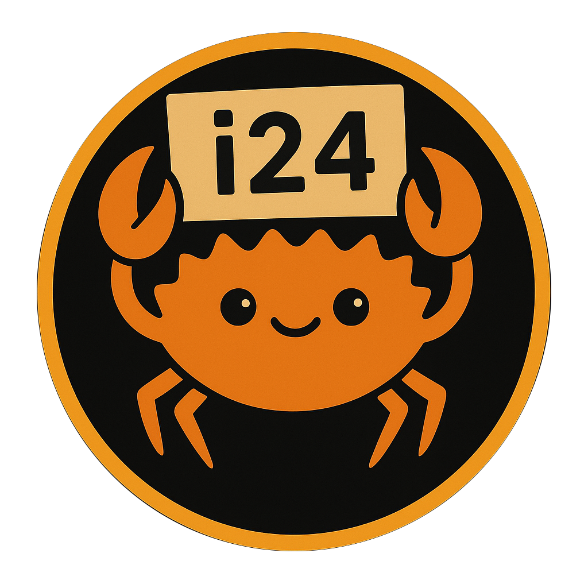
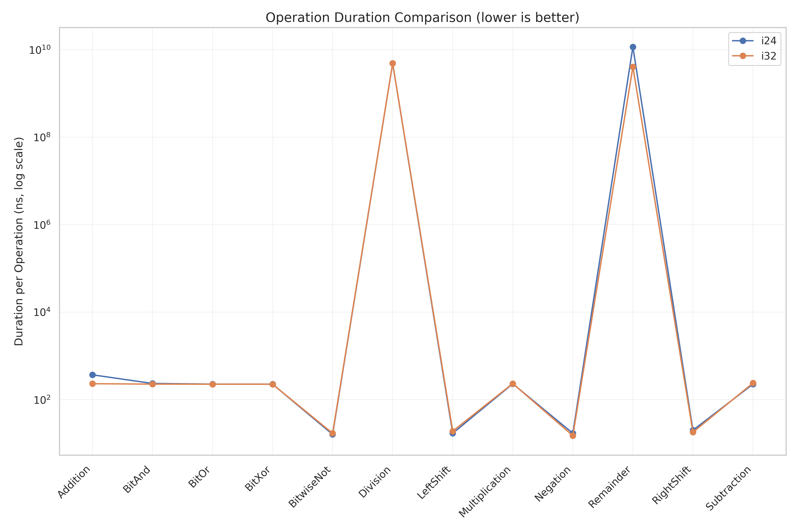

<div align="center">

# i24: A 24-bit Signed Integer Type for Rust



[](https://crates.io/crates/i24)[](https://docs.rs/i24)
</div>

`i24` provides a 24-bit signed integer type for Rust, filling the gap between `i16` and `i32`. This type is particularly useful in audio processing, certain embedded systems, and other scenarios where 24-bit precision is required but 32 bits would be excessive.

## Features

- Efficient 24-bit signed integer representation
- Seamless conversion to and from `i32`
- Support for basic arithmetic operations with overflow checking
- Bitwise operations
- Conversions from various byte representations (little-endian, big-endian, native)
- Implements common traits like `Debug`, `Display`, `PartialEq`, `Eq`, `PartialOrd`, `Ord`, and `Hash`

## Installation

Add this to your `Cargo.toml`:

```toml
[dependencies]
i24 = "2.0.0"
```

## Usage

```rust
use i24::i24;
let a = i24::from_i32(1000);
let b = i24::from_i32(2000);
let c = a + b;
assert_eq!(c.to_i32(), 3000);
```

## Safety and Limitations

- The valid range for `i24` is [-8,388,608, 8,388,607].
- Overflow behavior in arithmetic operations matches that of `i32`.
- Bitwise operations are performed on the 24-bit representation.
Always use checked arithmetic operations when dealing with untrusted input or when overflow/underflow is a concern.

## Optional Features

- **pyo3**: Enables [PyO3](https://crates.io/crates/pyo3) bindings for use in Python.
- **serde**: Enables serialisation and deserialisation via the [serde crate](https://crates.io/crates/serde)

## Contributing

Contributions are welcome! Please feel free to submit a Pull Request.

## License

This project is licensed under the MIT License - see the [LICENSE](https://github.com/jmg049/i24/blob/main/LICENSE) file for details.

## Benchmarks

The crate was tested using the code found in the [i24_benches](./i24_benches) directory of the repo. The full benchmark data can be found in the [benchmark report](./i24_benches/benchmark_analysis/benchmark_report.md).
Below is a figure which summarises the performance with repsect to the ``i32`` type. From the figure it is clear that the ``i24`` type mostly matches the performance of an ``i32`` with some slight variations.



## Related Projects

This crate was developed as part of the [Wavers](https://crates.io/crates/wavers) project, a Wav file reader and writer for Rust.
